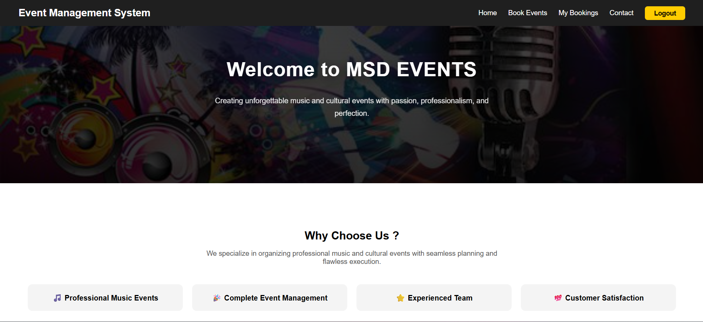
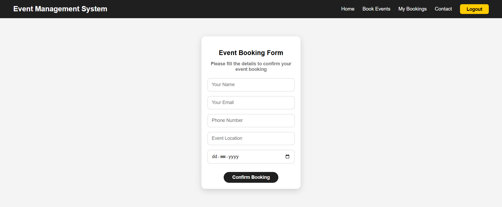
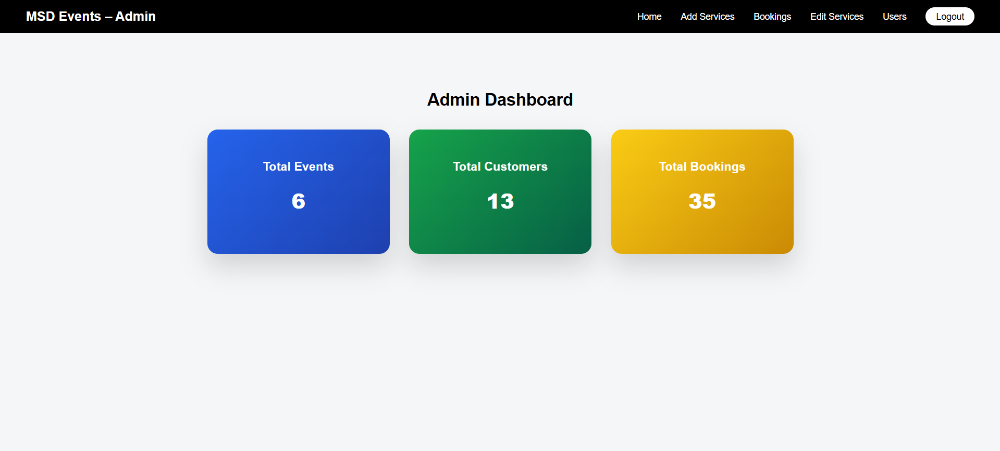

🎵 Music Event Management System

A full-stack Music Event Management System built using Django.
This web application allows users to explore events, view event details, and book events online.
It also includes a custom admin dashboard to manage event services, users, and bookings efficiently.

---

🚀 Features

User Registration and Login Authentication

Event Listing Page

Event Details Page

Event Booking System

Duplicate Booking Prevention

Email Notification for Booking Confirmation

Contact Form with Email Notification

My Bookings Page for Users

Custom Admin Dashboard

Add / Edit / Activate / Deactivate Event Services

Manage Customer Bookings

---

🛠 Technologies Used

Python

Django

HTML5

CSS3

JavaScript

SQLite

Django Authentication System

---

📁 Project Structure

music-event-management-system
│
├── event_management        # Django project settings
│
├── events                  # Main Django application
│   ├── migrations
│   ├── static
│   ├── templates
│   ├── models.py
│   ├── views.py
│   └── urls.py
│
├── media                   # Uploaded event images
├── screenshots             # Screenshots used in README
│   ├── home.png
│   ├── booking.png
│   └── admin.png
│
├── manage.py
├── requirements.txt
├── README.md
└── .gitignore

---

## 📸 Screenshots

### Home Page

### Event Booking Page

### Admin Dashboard

---

⚙ Installation & Setup

Clone the repository

git clone https://github.com/Navanee-1108/music-event-management-system.git

Navigate to the project folder

cd music-event-management-system

Install dependencies

pip install -r requirements.txt

Run migrations

python manage.py migrate

Start the development server

python manage.py runserver

Open in browser

http://127.0.0.1:8000

---

👨‍💻 Author

Developed by Navaneethakrishnan